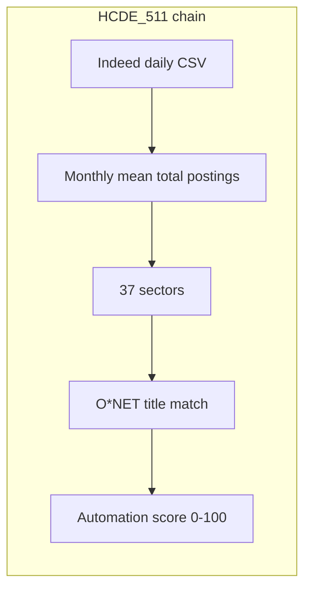

# Anthropic Economic Index — design notes for HCDE_511

Study of [Anthropic Economic Index](https://www.anthropic.com/economic-index) patterns and how this project applies them. Full data rules: [DATA_RULES.md](DATA_RULES.md).

## Two products, one question each

| Source | Question | Metric style |
|--------|----------|--------------|
| **AEI** | How is Claude used in work? | Usage share, AUI (vs population expected) |
| **This project** | How has Indeed job demand changed? | Posting index (vs Feb 1, 2020 = 100) |

Both use **O\*NET** for occupation structure. AEI measures **AI supply/adoption**; Indeed measures **employer hiring intent**. Comparing them is illustrative only—not causal.

## Measurement pipeline (show this to readers)

AEI’s chain: conversations → Clio → O\*NET task → occupation → usage/AUI. We mirror the idea: **pipeline before charts**.

## Job Market story vs explorer (local HTML)

| Page | Role | Generator |
|------|------|-----------|
| [`output/guide.html`](../output/guide.html) | **Primary story** — Next.js editorial UI: hero, national charts, top-10 bridge, sector detail, heatmap, automation scatter | [`scripts/build_guide.py`](../scripts/build_guide.py) → [`job-market/`](../job-market/) |
| [`output/explore.html`](../output/explore.html) | **Legacy** — stacked charts + dropdown sector picker | [`scripts/plot_explore_dashboard.py`](../scripts/plot_explore_dashboard.py) |

### Shared client state (`guide.html`)

| State | Purpose |
|-------|---------|
| `selectedSector` | Solid line, metrics, drawdown, top-10/sidebar selection, heatmap label |
| `comparisonSector` | Dotted overlay on sector detail chart only |
| `hoveredSector` | Top-10 row highlight |
| `selectedCategory` | Sidebar sector list filter (Knowledge Work / Care & Service / Tech & Engineering) |

Data: `data/processed/story_meta.json` (categories, top10, per-sector stats, quick fact). URL `?sector=` hydrates on load.

## Patterns borrowed from AEI

### Normalized metrics + plain language

- AEI: AUI > 1 = more use than population share predicts.
- Us: 100 = Feb 2020 volume; 72 = 28% fewer postings than that day.
- **UI:** Every headline number gets a hint line (stat cards, hovers).

### Dual benchmark

- AEI: Claude usage % (orange) vs employment share (gray).
- Us: Sector index vs national index in sector detail; drawdown from **sector’s own peak**.

### Curated exemplars, not 37 labels

- AEI: DC, CA, TX in geography figures.
- Us: Highlight Software Development, IT Systems, Nursing, Accounting on drawdown chart.

### Definitions before complexity

- AEI: Economic primitives table (Table 2.1) before scatter grids.
- Us: Definitions table + methodology strip on each HTML page.

### Linked facets across views

| Facet | Field |
|-------|--------|
| Time | `month` |
| Sector | `display_name` (37) |
| Labor demand | `index` |
| Automation | `automation_crosswalk.score` |
| AI supply | `ai_models` by `month` / `org` |

Explorer page (`output/explore.html`): sector picker updates detail panel and sector mini-chart; URL `?sector=` preselects on load. Drawdown bar click-sync is not implemented yet.

### Caveats (what we do not claim)

- Not raw job counts, wages, or unemployment.
- Automation score is keyword-matched O\*NET context—not Claude automation/augmentation.
- Model release timing ≠ proof AI caused posting changes.
- National average near 100 can mask sector collapse from 2021–2022 peaks.

## What AEI does that we do not (yet)

- Geographic explorer (state/country).
- Claude.ai vs API channel split.
- Longitudinal dataset releases on Hugging Face with versioned schema.

## References

- [Economic Index hub](https://www.anthropic.com/economic-index)
- [Introducing the Anthropic Economic Index](https://www.anthropic.com/research/the-anthropic-economic-index)
- [Geography report + dashboard](https://www.anthropic.com/research/anthropic-economic-index-september-2025-report)
- [Economic primitives (Jan 2026)](https://www.anthropic.com/research/anthropic-economic-index-january-2026-report)
- [Anthropic/EconomicIndex dataset](https://huggingface.co/datasets/Anthropic/EconomicIndex)
- Local story: [ai-viz](https://manasvikale99.github.io/ai-viz/)
